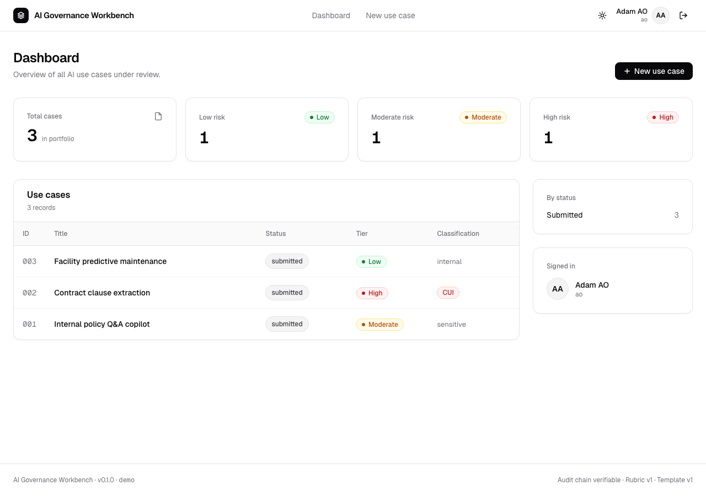
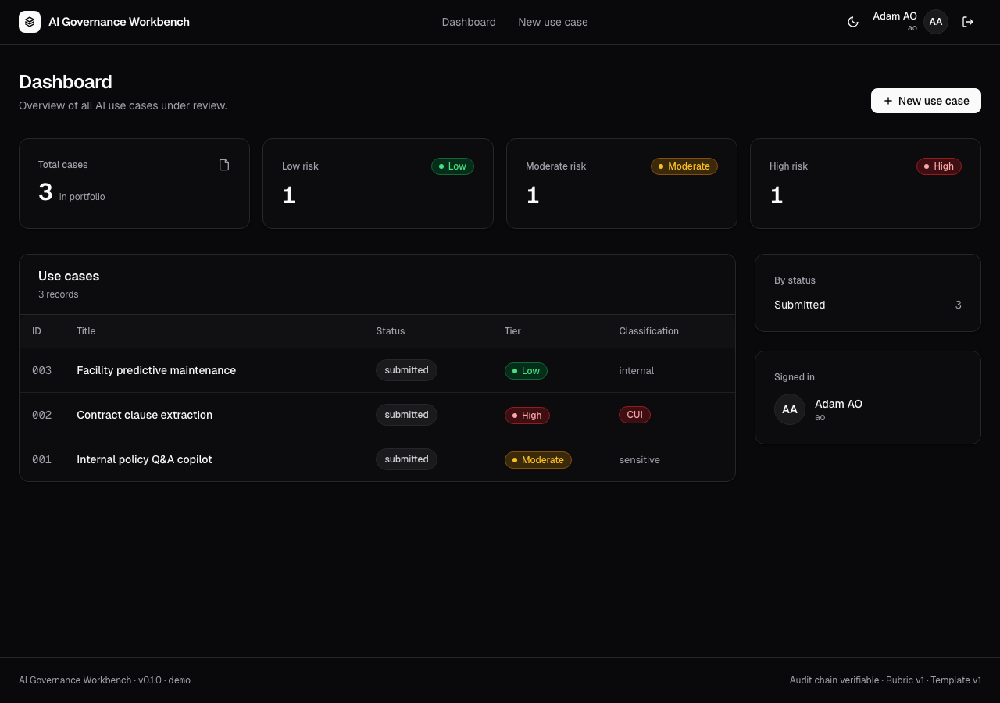
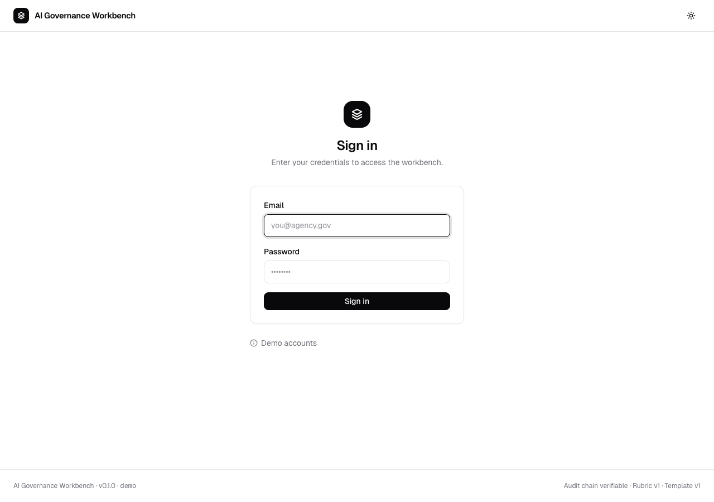
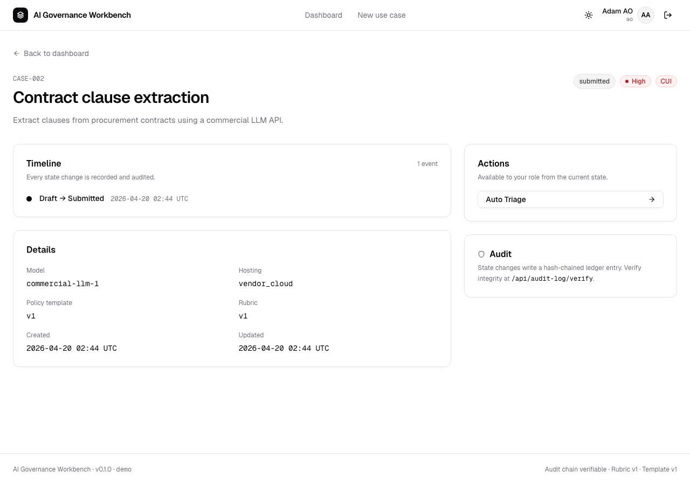
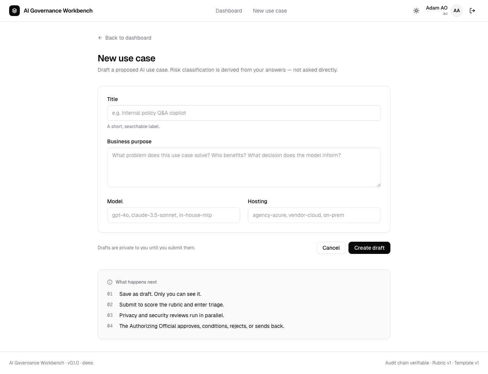

# Demo Walkthrough

A narrated tour of the AI Governance Review and Approval Workbench. All screenshots are from the v1 demo build with seeded users and sample use cases.

## What you're looking at

A lightweight internal platform that takes proposed AI use cases through a structured review workflow: **intake → risk scoring → parallel privacy/security reviews → authorizing-official decision → conditions → re-review**. Every state change is written to a hash-chained audit log. Separation of duties is enforced in the service layer, not just in the UI.

## Design

Clean, modern product UI in the spirit of Linear, Vercel, and shadcn/ui. Geist for both display and data, white surfaces with zinc-toned borders and subtle shadows, restrained color usage with risk tiers signaled by quiet badges (low: green, moderate: amber, high: red). **Dark mode is first-class** — every token has a dark variant, the theme toggle lives in the top nav, and the choice persists across sessions via `localStorage` with a system-preference fallback.

| Light | Dark |
|---|---|
|  |  |

## Sign in



Seven demo users are seeded on first boot, one per governance role. All share the password `demo`:

| Email | Role |
|---|---|
| `requestor@agency.gov` | Requestor (engineering/product sponsor) |
| `triager@agency.gov` | Security reviewer (triage duty) |
| `security@agency.gov` | Security reviewer |
| `privacy@agency.gov` | Privacy reviewer |
| `ao@agency.gov` | Authorizing Official |
| `ciso@agency.gov` | CISO / governance lead |
| `auditor@agency.gov` | Auditor / IG liaison (read-only) |

## Dashboard


Three sample use cases are seeded. They were picked to exercise different risk axes and the rubric correctly classifies each into a different tier:

| # | Title | Tier | Classification | Why |
|---|---|---|---|---|
| 1 | Internal policy Q&A copilot | Moderate | Sensitive | Touches employee PII; hosted inside agency boundary |
| 2 | Contract clause extraction | **High** | **CUI** | CUI data + external vendor hosting |
| 3 | Facility predictive maintenance | Low | Internal | No PII, no CUI, on-prem ML model |

A hiring-manager-friendly talking point: the rubric is inspectable code (`app/services/scoring.py`) backed by versioned JSON (`app/policy/rubric.json`). If a future incident reveals a mis-scored case, the fix is a rubric version bump, and every past decision retains its `rubric_version` field for provenance.

## Use case detail



The detail page shows the current state, business purpose, a timeline of every state transition, and the actions the logged-in user is authorized to perform from the current state. The action list comes from the state machine's `allowed_actions(state, role)` — the UI cannot offer an illegal move.

The three rubber-stamp badges in the upper right (`Tier · high`, `cui`, `submitted`) are the three pieces of information that most shape a governance decision, hoisted into immediate view.

## Filing a new use case



The intake form is intentionally small — title, business purpose, model, hosting. Risk classification is **derived**, not asked. The "What happens next" sidebar makes the lifecycle visible to the requestor before they submit.

## Decision packet (exportable record)

Every approval generates a Markdown decision packet. Here's the packet for the high-risk contract extraction case, in its pre-review state:

- [`docs/sample-decision-packet.md`](sample-decision-packet.md)

The packet includes intake answers, scoring breakdown, recommended controls (NIST SP 800-53 + AI RMF), review narratives, conditions, and the full timeline. Markdown is intentional — it's diffable, grep-able, and version-controllable. An auditor can reconstruct any decision from the packet alone.

## Walkthrough script (the 3-minute demo)

1. **Sign in as `requestor@agency.gov`.** Show the dashboard has three cases all in `submitted`. Click into "Contract clause extraction" to show how the scoring engine caught this as **high / CUI** from the intake answers alone.
2. **Log out, sign in as `security@agency.gov`.** Note the case is already past triage (seeded), but demonstrate the allowed actions change by role.
3. **Sign in as `auditor@agency.gov`.** Hit `/api/audit-log/verify` and show it returns `{"ok": true, "first_bad_id": null}`. Explain the hash-chain: every state-change row links to the prior by SHA-256, so tampering is detectable.
4. **Talking points to close with:**
   - *R-08 reflexivity* (from the scoping brief) — the workbench's own LLM features are entered **as a use case** in the workbench and approved through the same workflow. A governance tool that exempts itself fails its own thesis.
   - *SoD in the service layer* — a reviewer who tries to skip the UI and POST directly to the transition API still hits the same SoD guard. The controller is defense-in-depth; the service is the source of truth.
   - *Versioned policy* — bumping `rubric.json` version doesn't silently re-score existing decisions. Every approval is frozen against the version under which it was made.

## Running it yourself

```bash
cd project1
make install           # needs Python 3.12+
make run               # http://localhost:8000
# or, with Docker Desktop running:
make demo
```

Log in as any seeded user with password `demo`. No data leaves the container.
