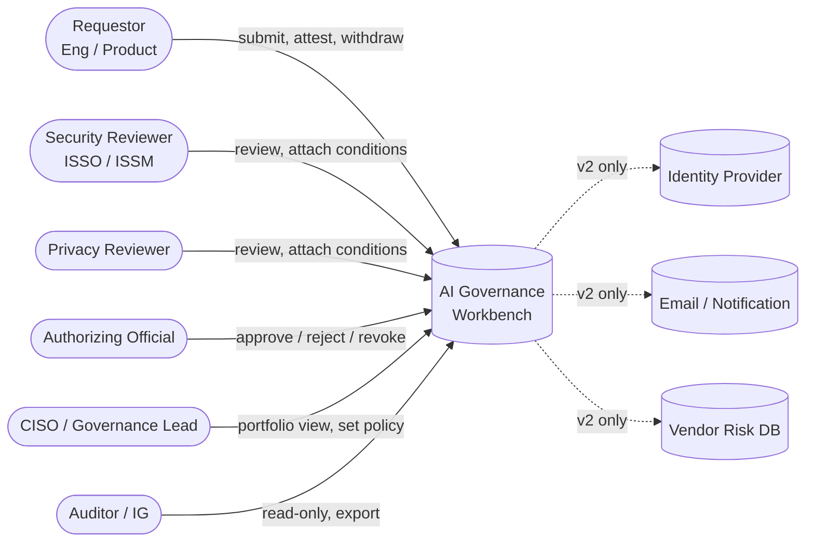
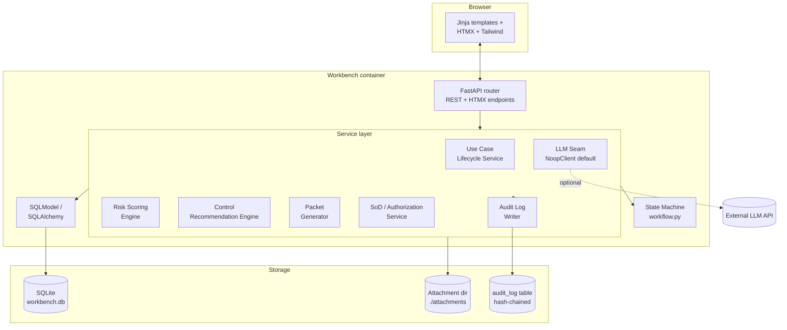
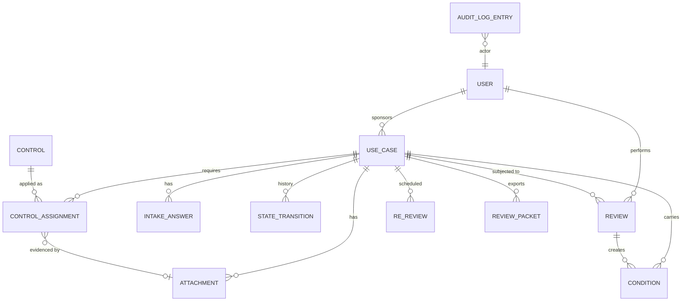
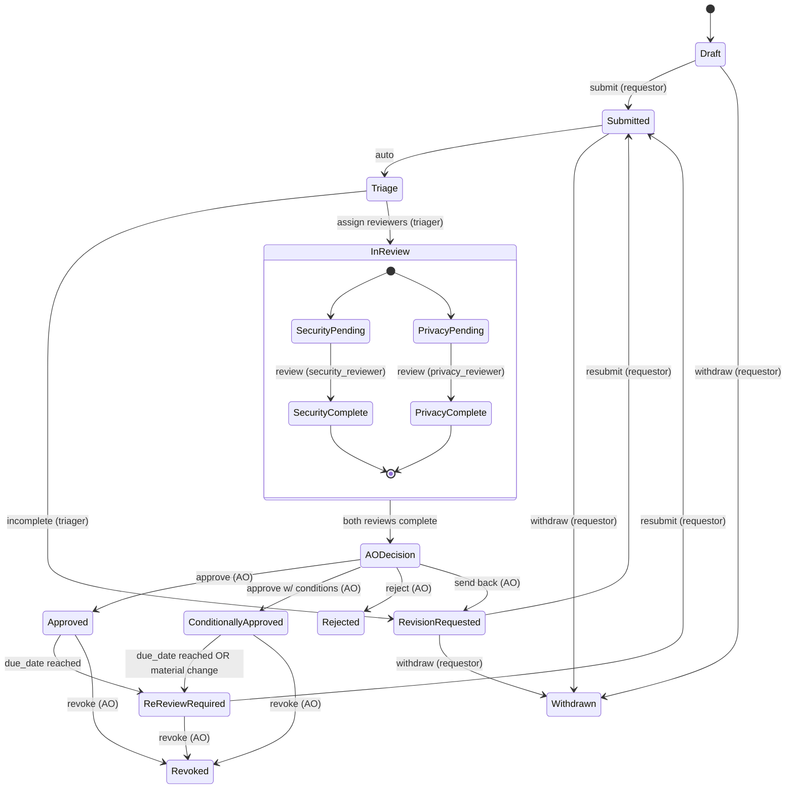
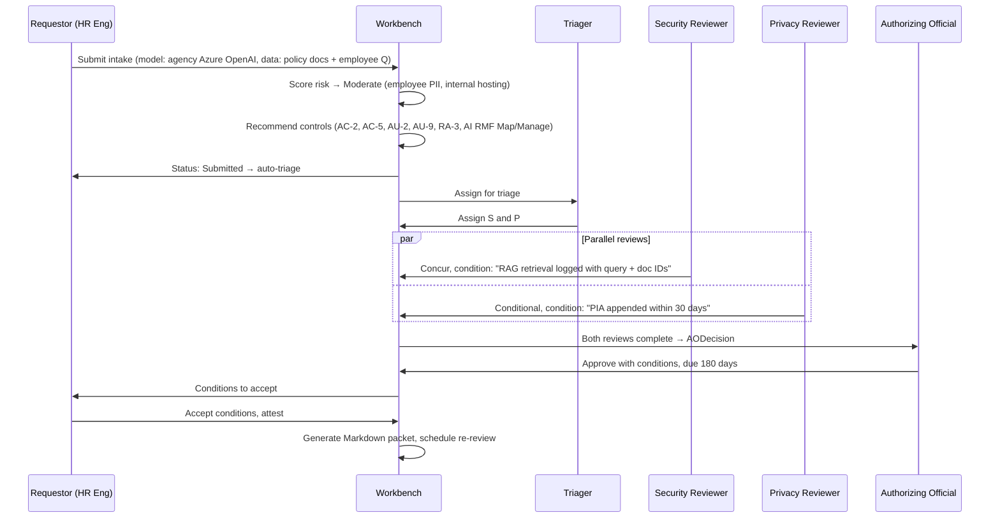

# AI Governance Review and Approval Workbench — Design Spec

**Date:** 2026-04-17
**Status:** Design (v1)
**Author:** Jacob Henson
**Companion:** `2026-04-17-ai-governance-workbench-scoping.md`
**Regulatory frame:** Federal civilian / FISMA Moderate (illustrative)

This document specifies the architecture, data model, workflow, interfaces, storage, controls, failure handling, and deployment for v1 of the workbench. It is the basis from which an implementation plan will be written.

---

## 1. Architecture Overview

### 1.1 Guiding principles

1. **Auditable by construction.** Every state-changing action is logged to a hash-chained, append-only ledger. Reconstruction of any decision is possible from the ledger alone.
2. **Boring stack.** FastAPI + SQLModel + SQLite + Jinja + HTMX + Tailwind. No frontend framework, no message bus, no microservices. The interesting part is the workflow, not the plumbing.
3. **Separation of duties enforced in code, not policy.** SoD checks live in the service layer, not the UI.
4. **AI features are opt-in, advisory, and themselves governed.** The workbench's own AI features are entered as a use case in the workbench and approved through the same workflow.
5. **The state machine is one file.** A reviewer or auditor can read every legal transition, guard, and side effect in a single place.

### 1.2 L1 Context Diagram



In v1 the workbench has no external dependencies. The dotted boxes are deferred to v2 and listed in §11.

---

## 2. Components (L2)

### 2.1 L2 Component Diagram



### 2.2 Component descriptions

| Component | Responsibility | Notes |
|---|---|---|
| **API router** | HTTP entry point. Returns HTML fragments for HTMX, JSON for `/api/*`. Validates inputs with Pydantic. | Auth middleware enforces session; authorization is delegated to SoD service, not done in the router |
| **Use Case Lifecycle Service** | Owns CRUD for use cases and orchestrates state transitions through the state machine | Only path through which a use case can change state |
| **Risk Scoring Engine** | Pure function: intake answers → risk tier (Low/Mod/High) + score breakdown | Deterministic and inspectable; rule version stored on each scoring event |
| **Control Recommendation Engine** | Pure function: risk tier + classification → list of required controls | Reads from a versioned `policy_template` JSON; no DB writes |
| **SoD / Authorization Service** | Single source of truth for "may actor X perform action Y on use case Z" | Called from every state-changing service method; never bypassed |
| **Audit Log Writer** | Appends hash-chained entries; computes `hash = sha256(prev_hash || canonical_payload)` | Synchronous with the originating transaction; no fire-and-forget |
| **State Machine (`workflow.py`)** | Declares states, transitions, guards, and side-effect hooks in one file | Hand-rolled, ~250 LOC target; readable end-to-end |
| **Packet Generator** | Renders a Markdown decision packet from use case, reviews, conditions, audit log slice | Pluggable PDF backend (WeasyPrint) for signatures |
| **LLM Seam** | `LLMClient` protocol with `NoopLLMClient` default; provider implementations live in `llm/providers/` | AI features feature-flagged per deployment; auto-disabled on CUI-classified cases |

### 2.3 Module layout (target)

```
app/
  main.py               # FastAPI app factory
  routes/               # HTTP layer (HTML + JSON)
  services/
    lifecycle.py
    scoring.py
    controls.py
    sod.py
    packet.py
    audit.py
  workflow.py           # state machine — one file, end-to-end
  llm/
    base.py             # LLMClient protocol
    noop.py             # default
    providers/          # opt-in implementations
  models/               # SQLModel tables
  policy/
    template.json       # versioned policy template
    rubric.json         # versioned scoring rubric
  templates/            # Jinja
  static/
tests/
  unit/
  integration/          # full stack against ephemeral SQLite
seed/
  users.json
  use_cases.json
docker/
  Dockerfile
  compose.yml
```

---

## 3. Data Model

### 3.1 ER diagram



### 3.2 Tables

| Table | Key fields | Purpose |
|---|---|---|
| `user` | `id`, `email`, `name`, `role` (enum: `requestor`/`security_reviewer`/`privacy_reviewer`/`ao`/`ciso`/`auditor`), `password_hash`, `active` | Local accounts. One role per user in v1; multi-role deferred. **Triage is performed by users with the `security_reviewer` role** — there is no separate triager role; the SoD constraint is that the triaging reviewer cannot also serve as the assigned Security reviewer on the same case |
| `use_case` | `id`, `sponsor_id` → user, `title`, `business_purpose`, `model_name`, `hosting`, `status` (state), `risk_tier`, `classification`, `policy_template_version`, `rubric_version`, `created_at`, `updated_at` | The aggregate root |
| `intake_answer` | `id`, `use_case_id`, `question_key`, `answer_value` (JSON), `version` | Versioned answers; resubmission creates a new version, prior versions retained |
| `attachment` | `id`, `use_case_id`, `kind` (enum: `architecture`/`dpia`/`vendor_contract`/`model_card`/`evidence`/`other`), `filename`, `sha256`, `bytes`, `uploaded_by`, `uploaded_at` | File on disk under `./attachments/<sha256-prefix>/<sha256>`; DB row is the source of truth for metadata |
| `review` | `id`, `use_case_id`, `reviewer_id`, `role`, `decision` (enum: `concur`/`non_concur`/`conditional`), `narrative`, `created_at` | One row per reviewer per review cycle |
| `condition` | `id`, `use_case_id`, `name`, `description`, `status` (enum: `proposed`/`accepted`/`satisfied`/`waived`), `source_review_id`, `created_at`, `satisfied_at` | Conditions outlive the review that created them; tracked through re-review |
| `state_transition` | `id`, `use_case_id`, `from_state`, `to_state`, `actor_id`, `reason`, `created_at` | Denormalized projection of the audit log; powers the case timeline view |
| `control` | `id`, `framework` (enum: `nist_ai_rmf`/`nist_800_53`), `control_id` (e.g. `AC-2`), `title`, `description` | Seeded reference table |
| `control_assignment` | `id`, `use_case_id`, `control_id`, `status` (enum: `required`/`evidenced`/`waived`), `evidence_attachment_id?`, `assigned_at` | Generated by Control Engine; reviewer marks status |
| `re_review` | `id`, `use_case_id`, `due_date`, `trigger` (enum: `scheduled`/`material_change`/`policy_change`), `completed_at?`, `status` | One row per scheduled or triggered re-review |
| `review_packet` | `id`, `use_case_id`, `version`, `markdown`, `pdf_path?`, `generated_at`, `generated_by` | Snapshot at decision time; never mutated |
| `audit_log_entry` | `id`, `prev_hash`, `hash`, `actor_id`, `action`, `entity_type`, `entity_id`, `payload_json`, `created_at` | Append-only; integrity verified by chain |

### 3.3 Notable invariants

- A `use_case` row's `status` field is **derived state**: it MUST equal the `to_state` of its most recent `state_transition`. Enforced by service layer; verified by integrity check at startup.
- An `audit_log_entry`'s `hash` MUST equal `sha256(prev_hash || canonical_json(payload))`. Verified by `audit verify` CLI command and on every container start.
- `intake_answer.version` is monotonic per `(use_case_id, question_key)`; readers always select the highest version unless explicitly asking for history.

---

## 4. Workflow State Machine

### 4.1 State diagram



### 4.2 Transition table

Every legal transition lives in `workflow.py` as a row in this table. The table is the spec.

| From | To | Action | Actor role | Guards | Side effects |
|---|---|---|---|---|---|
| Draft | Submitted | `submit` | requestor (sponsor) | Intake complete; required attachments present | Score risk tier; assign control checklist; audit |
| Submitted | Triage | `auto_triage` | system | — | Pick triager by round-robin; audit |
| Triage | RevisionRequested | `request_revision` | any reviewer | Reason required | Notify sponsor; audit |
| Triage | InReview | `assign_reviewers` | triager | One security and one privacy reviewer assigned; **neither is the sponsor** | Create pending Review rows; audit |
| InReview | InReview | `submit_review` | security_reviewer or privacy_reviewer | Reviewer is assigned to this case; reviewer is not the sponsor | Persist Review; persist any Conditions as `proposed`; audit |
| InReview | AODecision | `auto_advance` | system | Both Security and Privacy reviews submitted | Audit |
| AODecision | Approved | `approve` | AO | AO is not the sponsor; no `non_concur` reviews stand; no unresolved `proposed` conditions | Set `re_review.due_date = now + tier_default_days`; generate ReviewPacket; audit |
| AODecision | ConditionallyApproved | `approve_with_conditions` | AO | AO is not the sponsor; ≥1 condition `accepted` | Same as Approved + freeze conditions to `accepted`; audit |
| AODecision | Rejected | `reject` | AO | Narrative required | Generate ReviewPacket (rejection); audit |
| AODecision | RevisionRequested | `send_back` | AO | Reason required | Notify sponsor; audit |
| RevisionRequested | Submitted | `resubmit` | sponsor | Intake updated since `RevisionRequested` entered | Increment intake version; re-score; audit |
| Approved/ConditionallyApproved | ReReviewRequired | `expire` | system | `now >= due_date` | Audit |
| ReReviewRequired | Submitted | `resubmit` | sponsor | Material-change checklist completed; sponsor attestation | New intake version; re-score; audit |
| Approved/ConditionallyApproved/ReReviewRequired | Revoked | `revoke` | AO | Narrative required | Generate ReviewPacket (revocation); audit |
| Draft/Submitted/RevisionRequested | Withdrawn | `withdraw` | sponsor | — | Audit |

**SoD invariants enforced by guards:**
- Sponsor cannot review or approve their own use case.
- A reviewer cannot serve as both Security and Privacy on the same use case across its lifetime (not just the same cycle).
- The user who performed triage on a case cannot also be the assigned Security reviewer on that case.
- AO cannot have served as Security reviewer, Privacy reviewer, or triager on the same use case.

These checks live in `services/sod.py` and are called from the corresponding guards. They are also enforced at the API layer as defense-in-depth, but the service layer is the source of truth (per R-07 mitigation).

### 4.3 Re-review default cadences

| Risk tier | Default re-review interval |
|---|---|
| Low | 365 days |
| Moderate | 180 days |
| High | 90 days |

Material change (model swap, vendor change, classification change, user-population change) forces re-review immediately regardless of due date.

---

## 5. Data Flows (Sample Use Cases)

### 5.1 UC-1: Internal policy Q&A copilot



### 5.2 UC-2: Contract clause extraction (commercial LLM, vendor boundary)

```mermaid
sequenceDiagram
    participant R as Requestor (Procurement Eng)
    participant W as Workbench
    participant S as Security Reviewer
    participant P as Privacy Reviewer
    participant AO as Authorizing Official

    R->>W: Submit intake (model: commercial LLM API, hosting: vendor cloud, data: vendor contracts incl. CUI)
    W->>W: Score risk → High (CUI + external hosting)
    W->>W: Recommend controls (adds CA-3, SA-9, SR-3 for vendor; AU-9 strengthened)
    W->>W: Auto-disable workbench AI features for this case (CUI flag)
    W->>R: Status: Submitted → auto-triage
    Note over W: Triager assigns S and P
    par Parallel reviews
        S->>W: Non-concur — vendor terms permit training; require zero-retention addendum (condition)
    and
        P->>W: Concur pending S resolution
    end
    Note over W: Sponsor attaches updated vendor addendum, resubmits
    R->>W: Resubmit with addendum (intake v2)
    W->>S: Re-review
    S->>W: Concur with conditions: quarterly vendor attestation, CUI marking on outputs
    W->>AO: AODecision
    AO->>W: Conditionally Approved, due 90 days; revocation triggers documented
    W->>W: Generate packet (includes vendor addendum hash, condition list)
```

### 5.3 UC-3: Facility predictive maintenance (OT-adjacent, integrity/availability focus)

```mermaid
sequenceDiagram
    participant R as Requestor (Facilities Eng)
    participant W as Workbench
    participant S as Security Reviewer
    participant P as Privacy Reviewer
    participant AO as Authorizing Official

    R->>W: Submit intake (model: in-house ML, data: HVAC telemetry, no PII, OT-adjacent)
    W->>W: Score risk → Moderate (no confidentiality concern; integrity/availability elevated)
    W->>W: Recommend controls (CM-3, SI-7, SI-12; AI RMF Measure for drift)
    W->>R: Status: Submitted → auto-triage
    par Parallel reviews
        S->>W: Concur with conditions: drift monitoring + manual override always available
    and
        P->>W: Concur (no PII)
    end
    W->>AO: AODecision
    AO->>W: Approved, due 365 days
    W->>W: Generate packet; schedule annual re-review
    Note over W,R: 6 months later: model is retrained on new sensor set → material change
    R->>W: Trigger material-change re-review
    W->>R: Status: ReReviewRequired (early)
```

The three flows exercise: (UC-1) standard moderate path with parallel reviews, (UC-2) non-concur leading to revision and resubmission across the agency boundary, (UC-3) Approved path with mid-cycle material-change-driven re-review.

---

## 6. Interfaces

### 6.1 REST surface (selected; full OpenAPI generated by FastAPI)

| Method | Path | Purpose | Auth |
|---|---|---|---|
| `POST` | `/api/use-cases` | Create draft | requestor |
| `PATCH` | `/api/use-cases/{id}/intake` | Update intake answers | requestor (sponsor) |
| `POST` | `/api/use-cases/{id}/attachments` | Upload attachment | requestor or reviewer |
| `POST` | `/api/use-cases/{id}/transitions` | Execute a transition; body `{action, payload}` | role-dependent (see §4.2) |
| `GET` | `/api/use-cases/{id}` | Read use case + current state + history | any authenticated |
| `POST` | `/api/use-cases/{id}/reviews` | Submit a review with optional conditions | reviewer assigned |
| `POST` | `/api/use-cases/{id}/conditions/{cid}/accept` | Sponsor acceptance | sponsor |
| `POST` | `/api/use-cases/{id}/packet` | (Re)generate the decision packet | reviewer or AO |
| `GET` | `/api/use-cases/{id}/packet?fmt=md\|pdf` | Download packet | any authenticated |
| `GET` | `/api/dashboard` | Counts by state, tier, owner; expiring | any authenticated; auditor read-only |
| `GET` | `/api/audit-log?entity=use_case&id=...` | Filtered audit slice | any authenticated; full export gated to auditor/CISO |
| `GET` | `/api/audit-log/verify` | Recompute chain integrity, return chain head and result | auditor/CISO |

HTMX endpoints (`/ui/*`) return HTML fragments. They are thin wrappers over the same service calls — no business logic in templates.

### 6.2 Audit log entry schema

```json
{
  "id": 4218,
  "prev_hash": "9f3a...",
  "hash": "c1d4...",
  "actor_id": 17,
  "action": "submit_review",
  "entity_type": "use_case",
  "entity_id": 42,
  "payload": {
    "review_id": 803,
    "decision": "conditional",
    "conditions": ["zero_retention_addendum"],
    "from_state": "InReview",
    "to_state": "InReview"
  },
  "created_at": "2026-04-17T15:32:08Z"
}
```

`hash = sha256(prev_hash || canonical_json({actor_id, action, entity_type, entity_id, payload, created_at}))`. Canonical JSON: sorted keys, no whitespace, RFC 8785 if a library is convenient, hand-rolled otherwise.

### 6.3 LLM seam

```python
# llm/base.py
class LLMClient(Protocol):
    def summarize_intake(self, use_case: UseCase) -> AIArtifact: ...
    def extract_red_flags(self, narrative: str) -> list[AIArtifact]: ...
    def suggest_controls(self, use_case: UseCase) -> list[AIArtifact]: ...

@dataclass(frozen=True)
class AIArtifact:
    content: str
    model: str             # e.g. "anthropic/claude-3.5-sonnet"
    generated_at: datetime
    advisory: bool = True  # always True; field exists to make it explicit in storage
```

`NoopLLMClient` returns empty lists / placeholder strings labeled "AI features disabled." Provider implementations are gated by config (`AI_FEATURES_ENABLED=true`) and by per-case classification (CUI auto-disables regardless of flag).

---

## 7. Storage Choices

### 7.1 Database: SQLite in v1, Postgres-ready

**Why SQLite for v1:** the constraint is "single `docker compose up` on a laptop." Adding Postgres adds a service, a network hop, a connection-pool concern, and a wait-for-ready dance, all to demonstrate a workflow that fits in a few thousand rows. SQLite eliminates the tax.

**Why SQLAlchemy / SQLModel:** every ORM call goes through the same abstraction, so swapping to Postgres in production is a config change plus a migration export, not a rewrite. Connection string lives in `DATABASE_URL`.

**SQLite mode:** `WAL` journaling, `synchronous=NORMAL`, `foreign_keys=ON`. Single writer is acceptable at v1 volume; if write contention shows up, that's the signal to move to Postgres, not to optimize SQLite further.

### 7.2 Attachments: filesystem, content-addressed

Files are stored at `./attachments/<sha256[:2]>/<sha256>` with the DB row holding metadata. Content-addressed storage means deduplication is free and the DB never has to be the authority for file bytes. Backup is a `tar` of the attachments directory plus a `sqlite3 .backup`.

In v2: swap the storage backend for S3-compatible object storage; the abstraction is a `BlobStore` interface, not direct file ops.

### 7.3 Audit log: same DB, separate concern

The audit log lives in the same SQLite database for transactional consistency — an audit entry and the state transition it describes commit together or not at all. The hash chain is what makes it tamper-evident, not its physical location. In production, an attestation job exports the chain head daily to an external WORM target (per R-06).

### 7.4 What is NOT stored

- Plaintext passwords (Argon2 hash + salt)
- Raw LLM API responses for CUI cases (those features are off)
- Anything from external systems beyond explicit attachments

---

## 8. Control Mappings

### 8.1 NIST AI RMF (Govern / Map / Measure / Manage)

| AI RMF function | Workbench expression |
|---|---|
| **Govern** | Roles enumerated in §2; policy template versioned and surfaced on every use case; AO sign-off required for every authorization |
| **Map** | Intake form captures purpose, data, model, hosting, users, integrations; classification taxonomy applied; risk score derived from inputs |
| **Measure** | Dashboard exposes time-to-decision, conditional-approval rate, condition-satisfaction lag, expired-without-re-review count, per-reviewer approval distribution |
| **Manage** | Conditions tracked through lifecycle; re-review scheduled per tier; material-change triggers; revocation path |

### 8.2 NIST SP 800-53 (selected, illustrative)

| Control | Title (abbrev) | How the workbench supports it |
|---|---|---|
| **AC-2** | Account Management | `user` table; role lifecycle audited; deactivation supported |
| **AC-5** | Separation of Duties | SoD service enforces sponsor ≠ reviewer ≠ AO; cross-cycle SoD on Security/Privacy roles |
| **AC-6** | Least Privilege | Role-permission matrix in `services/sod.py`; auditor role is read-only by construction |
| **AU-2** | Event Logging | Catalog of audited events: every state transition, every review submission, every condition status change, every attachment upload, every login |
| **AU-9** | Protection of Audit Information | Hash-chained log; `audit verify` command; chain head exportable for external attestation |
| **CA-2** | Control Assessments | The review workflow itself; control assignments per use case track assessment completeness |
| **CM-3** | Configuration Change Control | Material-change checklist on re-review; new intake version on resubmit |
| **RA-3** | Risk Assessment | Scoring rubric versioned; risk tier recomputed on resubmit; reviewer override logged |
| **SI-12** | Information Management & Retention | Data minimization in intake (no free text where structured suffices); attachment retention policy documented |
| **SR-3** | Supply Chain Controls | Vendor / hosting captured in intake; vendor-related controls auto-added when hosting is external |

A production deployment would extend this table substantially. Twelve mappings are enough to demonstrate that the workbench was designed to map cleanly to a control framework, not retrofitted.

---

## 9. Failure Modes

| Failure | Detection | Response |
|---|---|---|
| Reviewer unresponsive past SLA | Dashboard query: `now - assigned_at > sla_days` | Highlight on triager dashboard; auto-notify (v2 email); never auto-approve |
| Hash chain break | Startup integrity check; `audit verify` command; periodic in-process check | Refuse to start writes; surface broken range; require signed admin override entry to resume (itself audited) |
| LLM provider outage | Provider call timeout / non-2xx | AI artifact omitted with explicit "AI features unavailable" marker; never blocks human workflow |
| LLM provider terms change (e.g., training enabled) | Config-level check at deploy; CI fails if provider is not on the zero-retention allowlist | Provider disabled until allowlist updated by governance change |
| Container restart mid-transition | All state changes are inside a DB transaction that includes the audit log row | On restart, no partial state visible; pending HTTP request fails cleanly; user retries |
| Concurrent reviewer edits | Optimistic locking via `updated_at` token on use case and review rows | 409 Conflict with current state returned; reviewer reloads |
| Attachment storage full | Pre-upload disk-space check; configurable threshold | Reject upload with explicit error; log to operator |
| DB corruption | SQLite integrity check (`PRAGMA integrity_check`) at startup | Refuse to start; restore from latest `.backup` plus replay any since-then audit entries from external attestation if available |
| Restore from backup creates audit chain divergence | Compare restored chain head to last externally attested head | If divergence detected, freeze writes; require admin reconciliation entry |
| Material change to approved case not declared | Detected by audit at re-review (intake diff vs. last approval) | Auditor finding; condition: declare and re-review |

---

## 10. Deployment Options

### 10.1 v1 demo (target)

```yaml
# docker/compose.yml (sketch)
services:
  workbench:
    build: .
    ports: ["8000:8000"]
    volumes:
      - ./data:/app/data            # SQLite + attachments
    environment:
      DATABASE_URL: sqlite:////app/data/workbench.db
      AI_FEATURES_ENABLED: "false"
      SECRET_KEY_FILE: /run/secrets/session_key
    secrets:
      - session_key
secrets:
  session_key:
    file: ./secrets/session_key
```

Single container. Seed users and three sample use cases load on first boot. `make demo` brings it up; `make reset` rebuilds.

### 10.2 Conceptual production (not built in v1, sketched for the spec)

| Concern | v1 | Production |
|---|---|---|
| Database | SQLite | Postgres (managed) |
| Attachments | Local FS | S3-compatible object store with versioning |
| Auth | Local accounts | SSO via SAML or OIDC; SCIM for provisioning |
| Notifications | None | Email / chat hook on state change |
| Audit chain attestation | Manual `audit verify` | Nightly job exports chain head to WORM bucket; weekly external re-verification |
| Backups | `sqlite3 .backup` + tar | Postgres PITR + object-store versioning |
| Reverse proxy | None | TLS-terminating proxy with WAF |
| Secrets | File-mounted | Secrets manager |
| Observability | Structured stdout logs | OpenTelemetry → log/metrics/tracing backend |

The v1 → production gap is enumerated rather than hidden, per R-10 mitigation.

---

## 11. Decisions Deferred to v2

- **SSO / enterprise identity** (SAML/OIDC, SCIM)
- **Multi-tenant** support
- **Email / chat notifications** on state change
- **Continuous monitoring** integrations (drift, accuracy decay, bias drift)
- **Vendor risk database** integration
- **Workflow customization in the UI** (additional reviewer roles, parallel/serial config)
- **Automated discovery** of AI usage across the environment
- **Direct enforcement** in production systems (gateway / proxy / runtime block)
- **Multi-role users** (one user serving multiple roles with strict per-case SoD)
- **Internationalization**

Each of these is a coherent v2 increment, not a hack against v1. The v1 architecture does not preclude any of them — the seams (LLM client, blob store, auth provider, notification sink) are placed where they will be needed.

---

## Appendix A: Open questions for implementation

These are deliberately deferred to the implementation plan, not the design:

1. **Test database strategy.** In-process SQLite per test vs. shared file with transactional rollback. Likely the former for isolation, the latter only for a few integration smoke tests.
2. **Seed data realism.** How thoroughly to populate the three sample use cases (just intake, or full review history including conditions and a packet)? Recommend full history for the demo to be self-explanatory.
3. **Packet rendering library.** Markdown is straightforward; PDF via WeasyPrint adds ~80MB to the container. Decide whether PDF is in v1 or deferred.
4. **Login UX.** Username/password form is sufficient; 2FA deferred. Confirm.
